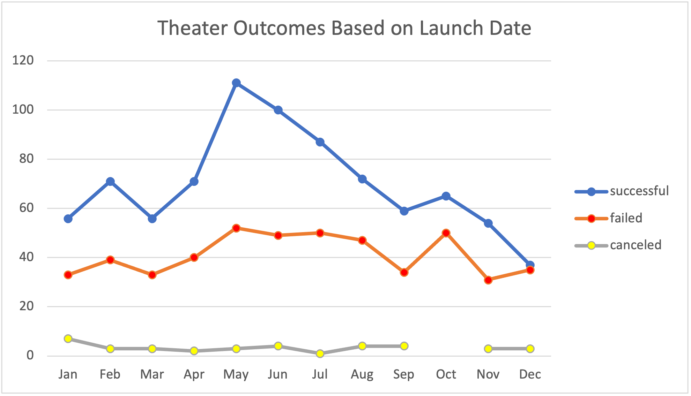
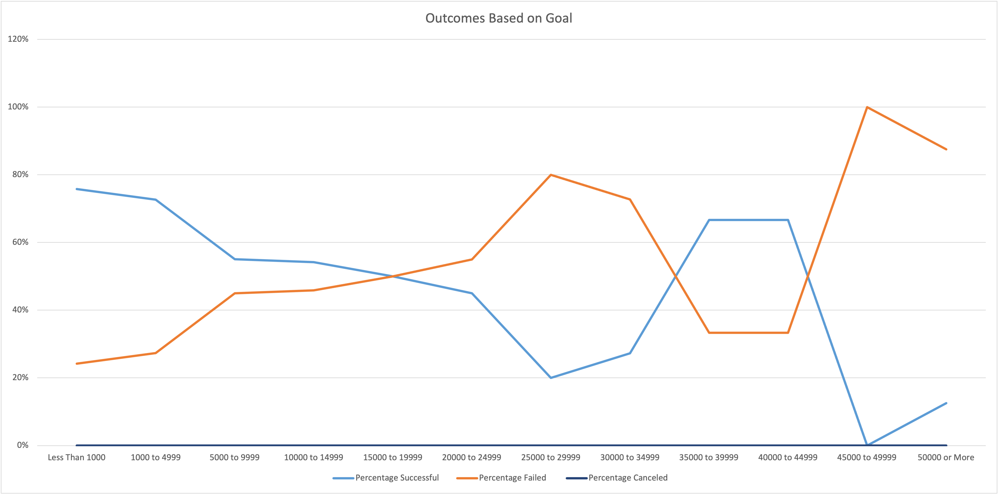

# Kickstarting with Excel

## Overview of Project
Utilizing data collected from a wide range of Kickstarter campaigns over the course of four years, many patterns did emerge to show ideal conditions for a successful Kickstarter theater campaign.

### Purpose
The purpose of this report is to provide ideal launch date ranges and fundraising goal amounts for the most successful results of a Kickstarter theater campaign. 

## Analysis and Challenges
The following charts and information outline the best month and fundraising goal amount for a Kickstarter theater campaign. The challenges present for the current dataset are only related to the age of the dataset and the exclusion of post-pandemic fundraising information.

### Analysis of Outcomes Based on Launch Date

The most successful month to launch a campaign is May. The least successful time range to launch a theater campaign on Kickstarter is between the months of November and January.

### Analysis of Outcomes Based on Goals

The most successful fundraising goal for a campaign is between $35,000 to $45,000, as the only other range that saw a greater rate of success were campaigns between $1 to $5000.

### Challenges and Difficulties Encountered
The challenges that could present for this data set are that this analysis is solely based on Kickstarter campaigns and there may be other platforms that have greater success hosting theater campaigns with larger fundraising goals. This data is also only representative of Kickstarter theater campaigns in Great Britain.

## Results

There are two conclusions that I can make about the Outcomes Based on Launch Date. The most successful month to launch a campaign is May. The least successful time range to launch a theater campaign on Kickstarter is between the months of November and January.

For Outcomes based on Goals, I can conclude that campaigns with a fundraising goal of more than $45,000 are the least likely to succeed.

There are some limitations of this dataset which include this is only representative of Kickstarter platform campaigns for plays for Great Britain between the years of 2013 and 2017 and will not be representative of a post-pandemic world or any other fundraising platform. This dataset is 5-9 years old.

I would recommend creating a table and chart to identify the fundraising goal amounts, launch date, length of campaign, and amount of donors for the top 10 most successful theater campaigns.

__________________________ Original Text / Unsure whether to retain or delete these placeholders_____________ 

# An Analysis of Kickstarter Campaigns
Performing analysis on Kickstarter data to uncover trends,
specifically US plays (both successful and failed campaigns)
and data for future projects in Great Britain.

I will add images of charts and graphs here

For the Kickstarter Campaign, I recommend a fundraising date range of beginning of May through the end of June, as these are the months with the highest participation.

Making your goal ambitious yet reasonable is best, as most failed campaigns had very high goals with low pledged amounts.

